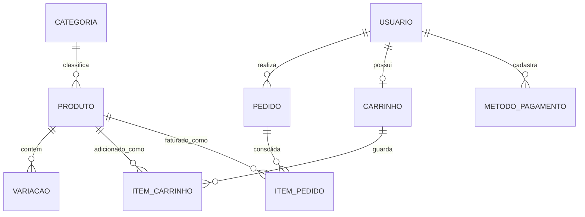

# 🛒 API E-commerce EJECT

## 1. Sobre o projeto
Este projeto consiste em uma API RESTful completa desenvolvida em Python e Django REST Framework para gerenciar o backend de um e-commerce. A arquitetura foi projetada com foco em boas práticas de engenharia de software, segurança de dados e isolamento de privilégios.

**Funcionalidades Principais:**
* **Autenticação e Segurança:** Login via JSON Web Tokens (JWT), criptografia de senhas e recuperação de credenciais via e-mail.
* **Gestão de Usuários:** Isolamento de rotas e visibilidade entre perfis de Lojistas e Clientes.
* **Catálogo Avançado:** CRUD de produtos com controle de visibilidade (Soft Delete), sistema de variações (cor/tamanho) e filtros dinâmicos de busca combinável.
* **Carrinho de Compras:** Gestão isolada por usuário e cálculos matemáticos geridos pelo lado do servidor para prevenção de falhas.
* **Checkout e Pedidos:** Transações atômicas para blindar a integridade financeira e máquina de estados para controle de status dos pedidos.
* **Pagamentos Seguros:** Sistema de proteção de dados que isola métodos de pagamento por usuário, simulando tokens de gateway externo.

---

## 2. Modelagem de Dados
Abaixo encontra-se o Diagrama de Entidade-Relacionamento (DER) que modela a arquitetura do banco de dados da API:



---

## 3. Instalação e Execução
Siga o passo a passo abaixo para rodar a aplicação no seu ambiente local.

**Pré-requisitos:** Python 3.10+ instalado.

**Passo 1:** Clone o repositório e acesse a pasta do projeto:
```bash
git clone https://github.com/gabrielaugustodeveloper/ecommerce-api-django.git
cd ecommerce-api-django
```

**Passo 2:** Crie e ative o ambiente virtual:

*Windows:*
```powershell
python -m venv venv
.\venv\Scripts\activate
```

*Linux/Mac:*
```bash
python3 -m venv venv
source venv/bin/activate
```

**Passo 3:** Instale as dependências:
```bash
pip install -r requirements.txt
```

**Passo 4:** Aplique as migrações do banco de dados:
```bash
python manage.py migrate
```

**Passo 5:** Inicie o servidor de desenvolvimento:
```bash
python manage.py runserver
```
A aplicação estará disponível em `http://127.0.0.1:8000`.

---

## 4. Dependências Principais
Este projeto foi construído utilizando as seguintes tecnologias e bibliotecas:

* **Django:** (Framework base)
* **Django REST Framework (DRF):** (Construção da API RESTful)
* **djangorestframework-simplejwt:** (Gestão e validação de tokens JWT)
* **drf-yasg:** (Geração automatizada da documentação Swagger)
* **SQLite3:** (Banco de dados padrão de desenvolvimento)

*Para a lista completa com as versões exatas, consulte o arquivo `requirements.txt` na raiz do projeto.*

---

## 5. Documentação da API (Swagger)
Todos os endpoints, exemplos de payloads, respostas esperadas e esquemas de autorização estão documentados de forma interativa utilizando o padrão OpenAPI.

Para acessar a documentação:

1. Garanta que o servidor esteja rodando localmente (`python manage.py runserver`).
2. Acesse a seguinte URL no seu navegador: `http://127.0.0.1:8000/swagger/`

Na interface do Swagger, você poderá testar as requisições, visualizar os modelos JSON esperados e validar os códigos de status HTTP para cada funcionalidade descrita neste projeto.

---

## 6. Execução via Docker (Ambiente Isolado)

Para garantir a portabilidade do projeto e eliminar de forma absoluta problemas de compatibilidade de infraestrutura (como divergências de versões do Python, caminhos de sistema ou dependências locais), a aplicação foi totalmente conteinerizada utilizando o **Docker** e o **Docker Compose**.

Essa abordagem isola a API, o banco de dados SQLite e o servidor de desenvolvimento em um ambiente padronizado, garantindo que o projeto execute perfeitamente em qualquer máquina com um único comando.

### Comandos Úteis de Gerenciamento (CLI Docker)

Como a API executa dentro de uma máquina isolada, os comandos tradicionais do Django do arquivo `manage.py` devem ser direcionados ao serviço `web` do Docker Compose. Abra um novo terminal na pasta do projeto e utilize as instruções abaixo:

* **Criar um Superusuário (Acesso ao Django Admin):**
  ```bash
  docker-compose exec web python manage.py createsuperuser
  ```

* **Criar Novas Migrações (Caso altere a estrutura dos Models):**
  ```bash
  docker-compose exec web python manage.py makemigrations
  ```

* **Executar a Suíte de Testes Automatizados dentro do Docker:**
  ```bash
  docker-compose exec web python manage.py test
  ```

* **Encerrar e Desligar o Container:**
  Para parar o servidor, você pode pressionar `Ctrl + C` no terminal onde o Docker está rodando ou, em um terminal adjacente, executar:
  ```bash
  docker-compose down
  ```

---

### Diferenciais Técnicos da Engenharia do Container

* **Hot-Reloading Ativo (Mapeamento de Volumes):** O arquivo `docker-compose.yml` utiliza o mapeamento de volumes (`.:/app`). Isso vincula a sua pasta local de desenvolvimento diretamente ao interior do container. Qualquer alteração feita no código-fonte (via VS Code) é detectada em tempo real pelo Django, reiniciando o servidor interno automaticamente sem que você precise reconstruir a imagem do Docker.
* **Sincronização de Logs Sem Buffer:** O ambiente do container foi configurado com a variável `PYTHONUNBUFFERED=1`. Isso garante que todos os logs de requisições HTTP (`200 OK`, `400 Bad Request`, etc.) e erros de depuração (*debugging*) sejam impressos na tela instantaneamente, facilitando o monitoramento da saúde da aplicação.
```